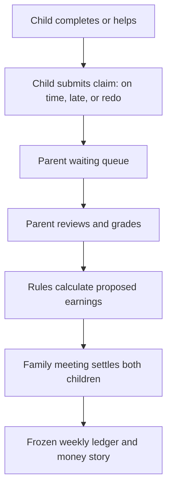
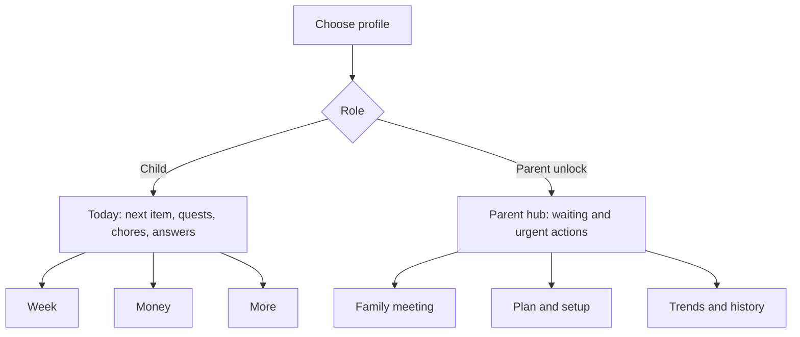

# Weekly Planner — Comprehensive Product, UX, Security, and Engineering Audit

**Repository:** [lxyzh1019-cyber/Weekly-Planner](https://github.com/lxyzh1019-cyber/Weekly-Planner)  
**Audited branch:** `main`  
**Audited commit:** [`23e8bb4fa98d6d35b18ab14d86b4952dcecd46b0`](https://github.com/lxyzh1019-cyber/Weekly-Planner/commit/23e8bb4fa98d6d35b18ab14d86b4952dcecd46b0)  
**Previous baseline:** [`0c8984b9d3772ca689a673965f22a60127a82ef5`](https://github.com/lxyzh1019-cyber/Weekly-Planner/commit/0c8984b9d3772ca689a673965f22a60127a82ef5)  
**Audit date:** 2026-08-05  
**Audience:** Product owner and an implementation agent such as Claude  
**Change authorization:** Audit and planning only. Do not change the repository from this report alone.

## Technical summary

The updated app is substantially stronger than the version previously audited. The most important improvement is not cosmetic: the chore-to-money workflow now has a coherent authority model inside the UI. Children make claims, parents review and grade them, earnings are calculated through a single settlement path, and the weekly ledger is frozen after settlement. Parent and child chore experiences are also separated into focused interfaces. These changes retire several earlier findings about unclear ownership and a weak parent action flow.

The app is now a credible family prototype, but it is not yet a privacy-safe or production-ready web application. The highest-priority issue is the security boundary. The checked-in source still uses one Firestore document (`weekly_planner/shared_state`), contains no Firebase Authentication flow, includes no Firestore rules, and exposes Parent mode directly from the profile selector. Firebase configuration in client code is normal and is not itself a secret; the problem is that the repository does not demonstrate who may read or write the shared family data or perform parent-only actions. Rules may exist in the Firebase Console, but this audit could not verify them.

The next major issue is experience architecture. The product contains many good capabilities, but its primary child experience is still organized around feature surfaces—Quests, Chores, My Money, Sisters, Print, Full Planner, Day Blocks, Goals, To-do, and Achievements—rather than the child's immediate question: **“What do I need to do today?”** The recent work reduced some duplication and removed one day mode, but the app still asks users to understand too much of the system before they can act.

Engineering quality has improved through merge tests and broad smoke coverage. However, those checks are manual, no GitHub Actions workflow was found for the audited commit, live Firebase behavior was not tested in this audit, and phone/portrait layouts remain unverified. The codebase is also accumulating structural debt: 29 ordered classic scripts share global state, the main stylesheet grew significantly, retired markup remains in the DOM, and runtime accessibility patching compensates for inconsistent component semantics.

**Readiness verdict:**

- **Family prototype on trusted devices:** usable, with meaningful workflow improvements.
- **Public deployment containing children's schedule or money data:** not ready until access control is proven.
- **Large visual redesign:** should wait until security and navigation architecture are settled.

## Audit scorecard

These scores are expert judgments from source and change-history review, not measured usability-test results.

| Area | Score | Confidence | Interpretation |
|---|---:|---|---|
| Product/domain logic | 8.5/10 | High | Chore claims, grading, payment calculation, settlement, and rule dating are thoughtfully modeled. |
| Child/parent role clarity | 8/10 | High | Interfaces are meaningfully separated, but Parent mode itself is not access-controlled. |
| Core workflow integrity | 8/10 | Medium-high | Source and tests cover the main handoff; live multi-device Firebase behavior was not rerun here. |
| Information architecture | 5.5/10 | High | Strong features are spread across too many top-level concepts and entry points. |
| Visual consistency | 6/10 | Medium | The UI has personality, but emoji, typography, controls, overlays, and old/new surfaces do not yet read as one system. |
| Accessibility | 6.5/10 | Medium | ARIA and keyboard support improved; automated and human assistive-technology checks are still absent. |
| Security and privacy | 3/10 | High for source evidence | No verifiable authentication, family isolation, repository-managed rules, or parent unlock boundary. |
| Test discipline | 7.5/10 | High | Merge and smoke coverage are much stronger and documented. |
| Automated delivery safety | 2/10 | High | No CI workflow or required deploy gate was found. |
| Maintainability | 5.5/10 | High | Domain modules improved separation, but global script ordering and CSS/DOM growth increase regression risk. |

## What changed since the previous audit

The audited `main` branch is 22 commits ahead of the earlier baseline and changes 29 files. The largest additions are dedicated modules for the child chore experience, parent chore experience, trends, and chore options. The smoke suite also expanded substantially.

| Previous finding | Current assessment | Evidence |
|---|---|---|
| Parent experience was not action-first | **Materially improved** | Parent chores now lead with waiting claims, grading, settlement, scheduling, attitude, and sick-day actions. |
| Children could be confused about what moves money | **Materially improved** | Children report completion state; parent review and settlement move money. |
| Chore and payment logic lacked a clear end-to-end handoff | **Materially improved** | Recent changes explicitly test completion → parent queue → grading → calculated payment → meeting settlement. |
| Day experience had too many modes | **Improved, not finished** | Checklist mode and morning/afternoon/evening zone tabs were removed; Timeline and Quest remain. |
| Quest experiences duplicated each other | **Improved** | The Quest Board now links to the Day Quest rather than duplicating the full list. |
| Accessibility semantics were inconsistent | **Improved, not finished** | Runtime code adds labels, roles, keyboard behavior, and state attributes. |
| Firebase security was not demonstrated | **Still valid and now more important** | One shared document remains; no auth flow or rules file was found. |
| The app did not default to a simple “Today” experience | **Still valid** | The main week surface remains feature-rich and control-heavy. |
| Navigation and visual density were high | **Still valid** | Five top-bar actions, view modes, weekly analytics, and three planning panels compete on the week screen. |
| Testing and reproducibility were weak | **Strongly improved, incomplete** | Merge and browser smoke tests exist, but they are not enforced by CI. |

Recent work is documented in [PR #59](https://github.com/lxyzh1019-cyber/Weekly-Planner/pull/59), [PR #60](https://github.com/lxyzh1019-cyber/Weekly-Planner/pull/60), and [PR #61](https://github.com/lxyzh1019-cyber/Weekly-Planner/pull/61). Statements taken from PR descriptions are treated as developer-reported until independently rerun.

## The improved workflow is now the product's strongest part

The chore and money workflow has a sensible sequence of authority. This should be preserved during any redesign.

The important design principle is that **a child's tap records evidence, not a financial transaction**. Parent review remains the control point, and the family meeting remains the settlement point. Any future UI work must keep this invariant.

Additional strengths to retain:

- Effective-dated rule changes protect historical weeks from later price edits.
- Unplanned chores can be claimed without corrupting the planned schedule.
- Children can see waiting and newly answered claims without receiving parent grading controls.
- Settlement prevents premature celebration when only one child is complete.
- Override messaging explains when a rule, rather than a grade, determines payment.
- Remote state merge logic includes conflict-aware handling and tombstones instead of simple last-write replacement for every collection.
- Local storage failures, offline state, and pending sync are surfaced to users.
- Compact treatment for short training blocks reduces clutter without discarding information.

## Priority findings

### P0 — The repository does not prove a safe data or authority boundary

**Observed:** [`js/03-sync.js`](https://github.com/lxyzh1019-cyber/Weekly-Planner/blob/main/js/03-sync.js) initializes Firestore and reads/writes the same `weekly_planner/shared_state` document. No Firebase Authentication call or Firestore rules file was found in the repository. [`index.html`](https://github.com/lxyzh1019-cyber/Weekly-Planner/blob/main/index.html) provides a direct `selectProfile('parent')` button.

**Risk:** If deployed rules allow broad access, anyone who can reach the Firebase project may be able to read or overwrite children's schedules, notes, chore history, and money data. Even with restrictive database rules, a child using the same app can enter Parent mode and reach grading, settlement, reset, and configuration controls unless there is an external protection not represented in source.

**Important distinction:** The Firebase API key in the browser is not the vulnerability; Firebase client configuration is normally public. The required controls are authenticated identity, authorization rules, family-level data isolation, and a parent action boundary.

**Required response before further expansion:**

1. Export and review the active Firestore rules from the Firebase project.
2. Decide the identity model: one authenticated family, individual family members with roles, or another explicit model.
3. Move shared data under a family-scoped path such as `families/{familyId}/...`; do not rely on one global document.
4. Deny unauthenticated reads and writes by default.
5. Ensure one family cannot read or mutate another family's data.
6. Protect parent-only mutations. A cosmetic client-side PIN alone is not a backend authorization control.
7. Create a migration and rollback plan before changing the existing document structure.

**Acceptance criteria:** automated emulator tests prove that an unauthenticated client is denied, Family A cannot access Family B, and a child identity cannot perform parent-only financial/configuration mutations.

### P1 — The default child experience is still feature-first rather than today-first

**Observed:** The week screen presents Quests, Chores, My Money, Sisters, Print, two week views, weekly analytics, Goals, To-do, and Achievements. Quest Board and Day Quest remain distinct concepts. The profile screen asks users to absorb a long philosophy statement before the app's practical value becomes apparent.

**Impact:** Children must build a mental model of the application before answering a simple daily question. Every additional top-level concept increases choice cost, especially on smaller screens and for younger users.

**Recommendation:** Make **Today** the default child destination. It should show, in order:

1. current/next scheduled item;
2. today's small quest list;
3. chores that can be claimed;
4. pending parent answers;
5. one lightweight progress or encouragement element.

Move Week, Money, and secondary features behind a stable four-item navigation system. Preserve the existing detailed week planner as a destination, not the front door.

### P1 — Navigation still exposes too many competing primary actions

**Observed:** The week header alone has five labeled actions plus two view modes. Other screens add separate back paths, profile switches, money shortcuts, parent banners, sheets, and overlays.

**Impact:** Repeated shortcuts create inconsistent back behavior and make it unclear which surfaces are primary. The user can reach the same domain through several paths, increasing testing cost as well as cognitive load.

**Recommendation:** Establish one global navigation model and one context-action area. A feature should appear globally only if it is needed frequently from most screens. Print, Sisters, Trends, setup, backup/reset, and similar tools belong under More or inside the relevant parent area.

### P1 — Test coverage is meaningful but is not enforced

**Observed:** [`tests/README.md`](https://github.com/lxyzh1019-cyber/Weekly-Planner/blob/main/tests/README.md) documents JavaScript syntax checks, 50 merge tests, and a broad Playwright-based smoke flow. PR #61 reports 115 smoke checks and two clean runs. No `.github/workflows` configuration or workflow run was found for the audited commit.

**Impact:** A contributor can merge a change without running the checks. The highest-risk failures in this application are cross-screen data inconsistencies that can look visually correct, so a manual convention is not sufficient.

**Recommendation:** Add CI that runs syntax, merge, and smoke tests on every pull request. Upload smoke screenshots as build artifacts and block merge on failure. Pin the browser/dependency setup so local and CI results match.

### P1 — Responsive behavior and real synchronization are unverified

**Observed:** Recent PR notes limit visual verification to 1024×768 landscape and state that portrait/phone and live Firebase round trips were not verified.

**Impact:** The app may work on the development viewport while controls overflow, become too small, or reorder poorly on the devices children actually use. Merge unit tests do not prove timing, permissions, offline recovery, or simultaneous two-device behavior against Firestore. **(The two-device half of this is built — `tests/merge.test.js` carries the harness and the matrix below. Timing against real Firestore is still not covered. See `AUDIT-SYNC.md`.)**

**Required test matrix:**

| Dimension | Minimum cases |
|---|---|
| Viewport | 390×844 phone portrait; 768×1024 tablet portrait; 1024×768 tablet landscape; 1440×900 desktop |
| Role | Jenn; Jess; Parent |
| Input | Touch; keyboard; mouse |
| Network | Online; offline edit then reconnect; two devices editing different records; conflicting edit to same record |
| Critical flow | Plan chore; child claim; parent grade; rule calculation; settle both children; reopen frozen ledger |

### P2 — The visual language is expressive but not yet a coherent system

**Observed:** Four handwriting/rounded typefaces, many emoji used as interface icons, several button patterns, banners, cards, sheets, overlays, and old/new visual treatments coexist. Emoji rendering changes by operating system.

**Impact:** Personality is high, but hierarchy and predictability are lower than they should be. Platform-dependent emoji also makes pixel-level matching impossible and can weaken accessibility when the symbol carries meaning.

**Recommendation:** Define a small token and component system before another visual pass:

- one body font and at most one display/accent font;
- semantic color tokens with tested contrast;
- one icon family for functional actions, with emoji reserved for delight;
- standard primary, secondary, quiet, and destructive buttons;
- standard card, sheet, banner, tab, and form patterns;
- touch targets of at least 44×44 CSS pixels;
- spacing, radius, shadow, and type scales documented in CSS variables.

Do not attempt “pixel-perfect” implementation while the navigation and component inventory are still changing.

### P2 — The profile screen delays action

**Observed:** A long manifesto appears beneath the three profile choices.

**Impact:** The welcoming philosophy is positive but competes with the actual entry task and makes the first screen visually longer and denser.

**Recommendation:** Keep the one-line motto. Move the longer explanation to an optional “How this planner works” panel or first-run onboarding that can be dismissed.

### P2 — Terminology asks users to translate between overlapping mental models

**Observed:** The product uses Week, Full Planner, Day Blocks, Quest Board, Today's Quests, Day Quest, Chores, My Money, Money Story, and Money School.

**Impact:** Each label is understandable in isolation, but together they make users decide whether something is a plan, quest, task, chore, or money event.

**Recommendation:** Establish a small glossary and use it consistently:

- **Plan** = scheduled time;
- **Quest** = child-facing actionable item for today;
- **Chore** = household contribution that may generate a claim;
- **Claim** = child's completion report awaiting parent response;
- **Settlement** = parent/family action that finalizes money.

### P2 — Architecture is modular by file but still globally coupled

**Observed:** The app loads 29 ordered classic scripts into a shared browser global scope. The CSS comparison shows large growth. Retired markup such as the hidden compact week view remains in the page. Many interfaces are built through `innerHTML` and inline event handlers.

**Impact:** A change can depend silently on load order, global variables, element IDs, and side effects in another module. Old DOM and CSS create ambiguity about what is still supported. Broad rerendering and a global `MutationObserver` used for accessibility enhancement may also become a performance risk as the UI grows; this is a source-based risk, not a measured performance result.

**Recommendation:** Avoid a rewrite. Incrementally:

1. document the state schema and module ownership;
2. remove confirmed dead DOM/CSS after regression coverage exists;
3. replace inline handlers with module-owned event binding one surface at a time;
4. move shared utilities and selectors behind explicit namespaces or ES modules;
5. centralize component rendering and accessibility semantics;
6. add schema versioning and migration tests for saved data.

### P2 — Security hardening beyond authorization is incomplete

**Observed:** No Content Security Policy was found. Firebase and Google Fonts load from third-party origins. Inline handlers and extensive HTML string rendering make a strict policy and input auditing harder.

**Impact:** This does not prove an exploitable vulnerability, but it increases the cost of preventing script injection and third-party supply-chain failures.

**Recommendation:** After the auth/rules work, inventory every user-controlled string that enters HTML, standardize escaping or DOM construction, self-host or tightly pin critical assets where appropriate, and introduce a CSP in report-only mode before enforcement.

## Recommended target experience

The redesign should reduce the number of decisions visible at once without removing capability.

### Child navigation

Use four stable destinations: **Today, Week, Money, More**. Chores appear in Today when relevant and can also have a detailed view under More. The child should not see parent setup, grade controls, rule configuration, reset, or settlement controls.

### Parent navigation

Open on an action queue: claims waiting, incomplete settlement steps, sync warnings, and time-sensitive planning. Keep **Family Meeting**, **Plan & Setup**, and **Trends & History** as secondary destinations. Parent mode must require an actual trust boundary, not only a different color or profile flag.

### Visual hierarchy

Each screen should have:

- one clear page title;
- one primary action at most;
- contextual secondary actions grouped together;
- progressive disclosure for rules and explanations;
- visible system status only when it requires attention;
- consistent back/navigation behavior.

## Improvement plan and release gates

### Phase 0 — Prove security before adding scope

**Work:** audit deployed Firebase rules, introduce authenticated/family-scoped access, protect parent-only mutations, design migration and recovery, and document the threat model.

**Exit gate:** emulator tests prove deny-by-default, cross-family isolation, and role enforcement; an existing family can migrate without data loss; backup/restore is tested.

### Phase 1 — Make the current app safe to change

**Work:** add GitHub Actions for syntax/merge/smoke, upload screenshots, define a required test matrix, pin dependencies, and add a production-like Firebase emulator job.

**Exit gate:** every pull request receives reproducible pass/fail status and visual artifacts; critical chore-to-money tests are required.

### Phase 2 — Simplify information architecture

**Work:** create the Today-first child shell, reduce global navigation to four destinations, consolidate Quest entry points, simplify the profile screen, and move rare features under More.

**Exit gate:** a child can answer “what now?” within one screen and submit a chore claim without navigating through the full planner; no existing planning or money data is lost.

### Phase 3 — Consolidate the parent experience

**Work:** make Waiting the parent home, group meeting/setup/trends, remove duplicate shortcuts, and apply parent unlock/session behavior consistently.

**Exit gate:** a parent can clear all waiting claims and complete settlement from one predictable flow; children cannot enter or invoke those actions.

### Phase 4 — Apply one design system across all surfaces

**Work:** token audit, icon replacement, typography reduction, standard components, contrast/focus review, and responsive layouts across the defined viewport matrix.

**Exit gate:** screenshot review passes at phone, tablet portrait, tablet landscape, and desktop; keyboard navigation and a screen-reader smoke pass cover each primary flow.

### Phase 5 — Pay down structural debt incrementally

**Work:** remove dead DOM/CSS, isolate globals, migrate one surface at a time to explicit modules/events, document state ownership, and add performance budgets.

**Exit gate:** no feature depends on removed markup; tests remain green; boot and rerender performance do not regress; saved-state migrations are covered.

## Instructions for Claude or another coding agent

Treat this section as the execution contract.

### Non-negotiable product invariants

1. A child may create or update a claim but must never directly grade, settle, or move money.
2. Parent review is the authority point; family meeting settlement is the financial finalization point.
3. Settled historical weeks remain immutable unless an explicit, audited correction flow exists.
4. Rule changes are effective-dated and must not silently recalculate settled history.
5. Jenn and Jess data must remain isolated at the profile level, and families must be isolated at the backend level.
6. Offline edits and reconnect behavior must not silently discard data.
7. Do not replace the current state model or rewrite the entire application in one change.

### Required process for every implementation pull request

1. State the exact user problem and affected user journey.
2. List the files, state fields, and cross-screen consumers affected.
3. Add or update a regression test before changing shared calculation or merge logic.
4. Make the smallest coherent change; avoid unrelated cleanup.
5. Run every `node --check` syntax check, `node tests/merge.test.js`, and `node tests/smoke.js`.
6. Attach screenshots for the affected role at 390×844, 768×1024, 1024×768, and 1440×900 when layout changes.
7. Verify keyboard focus, accessible name, state announcement, and 44×44 touch targets for changed controls.
8. Describe data migration and rollback if stored state, Firestore paths, or rules change.
9. Report known limitations and untested cases explicitly.
10. Do not merge or deploy without the owner's approval.

### First recommended Claude task

Do **not** start with a visual rewrite. Start with a read-only security evidence package:

> Inspect the active Firebase architecture and the repository at commit `23e8bb4fa98d6d35b18ab14d86b4952dcecd46b0`. Retrieve the deployed Firestore rules if authorized. Document the current read/write model, every parent-only mutation, all child-readable data, and the migration risk of replacing `weekly_planner/shared_state` with family-scoped documents. Propose rules and emulator tests, but do not deploy or modify production data. Clearly separate confirmed behavior from assumptions.

After Phase 0 and Phase 1 are complete, the next appropriate task is a coded, screenshot-tested Today shell that reuses existing functions and state rather than reimplementing business logic.

## Method, evidence, and limitations

### Evidence reviewed

- Current `main` source at the audited commit.
- Comparison with the prior-audit commit: 22 commits and 29 changed files.
- Recent pull requests #59–#61 and their documented scope/known limitations.
- [`index.html`](https://github.com/lxyzh1019-cyber/Weekly-Planner/blob/main/index.html), [`js/03-sync.js`](https://github.com/lxyzh1019-cyber/Weekly-Planner/blob/main/js/03-sync.js), parent/child chore modules, trends/options modules, runtime accessibility code, and test documentation.
- Repository workflow status for the audited commit.

### What this audit did not establish

- It did not inspect the Firebase Console, deployed Firestore rules, hosting headers, analytics, or production logs.
- It did not run the current branch in a browser during this audit because the available local checkout did not match the current GitHub `main`; no repository mutation was authorized.
- It did not independently rerun the PR-reported 50 merge tests or 115 smoke checks.
- It did not perform a current screenshot-to-mockup pixel comparison. No current deployed URL or complete current-device screenshot set was provided.
- It did not conduct child usability sessions, parent usability sessions, screen-reader testing, penetration testing, or a live two-device sync test.

Accordingly, visual findings are source-structure judgments, not a substitute for a rendered visual QA pass. Security findings describe what the repository proves; external controls may improve the deployed posture, but they must be produced as evidence before the risk can be closed.

## Further questions to resolve before implementation

1. Is the application intended only for one trusted household, or will multiple families use the same deployment?
2. What are the active Firestore rules, and who currently has access to the Firebase project?
3. Which device is primary: shared tablet, each child's phone/tablet, or desktop?
4. What age range should the child experience optimize for?
5. Is Hero Mode the permanent core experience or an optional theme?
6. Which three actions do children use most often, based on real usage rather than intended design?
7. Should a child be able to switch between Jenn and Jess, or should profiles also be protected?
8. What is the approved recovery procedure if a settlement or remote merge is wrong?

## Bottom line

The previous view is only partly valid. The updated app has solved much of the chore-system ambiguity and has a notably better parent workflow. The next step is not another broad feature expansion. It is to prove the security boundary, automate the regression suite, and reorganize the child experience around Today. Once those foundations are in place, a disciplined design-system pass can make the interface look as coherent as the underlying chore/payment logic has become.
